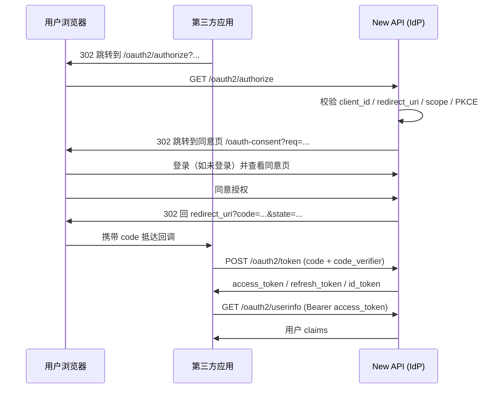

New API 只支持 **Authorization Code** 授权类型（`response_type=code`），可叠加 PKCE。本页说明从发起授权到拿到令牌的完整时序，包括 New API 内部的用户同意环节。

## 时序总览

## 分步说明

<Steps>
  <Step title="应用发起授权">
    应用把用户浏览器重定向到 `/oauth2/authorize`，带上 `response_type=code`、`client_id`、`redirect_uri`、`scope`、`state`，以及（公开客户端必填的）`code_challenge` + `code_challenge_method=S256`。
  </Step>
  <Step title="服务器校验请求">
    New API 依次校验：授权服务器是否启用、`client_id` 是否存在且启用、`redirect_uri` 是否精确匹配注册值、`response_type` 是否为 `code`、scope 是否在允许范围、PKCE 是否满足要求。

    - **无法安全回跳的错误**（未知 `client_id`、未注册 `redirect_uri`、服务器未启用）会直接渲染一个 HTML 错误页，**不重定向**。
    - **客户端与回调已可信之后的错误**（如 `unsupported_response_type`、`invalid_scope`、PKCE 相关 `invalid_request`）会通过 `redirect_uri` 以查询参数形式回传 `error` / `error_description` / `state`。
  </Step>
  <Step title="用户登录并同意（New API 内部）">
    校验通过后，请求被存为一次性"待授权"记录，浏览器 302 到 New API 前端的同意页 `/oauth-consent?req=<token>`。用户在此登录（若未登录），同意页展示你的应用信息与申请的 scope。

    <Info>
    同意页及其后端接口（`/api/oauth-server/authorize/*`）属于 New API 内部实现，**第三方应用不直接调用**。若用户此前已授权过相同或更小范围的 scope，可跳过同意页。
    </Info>
  </Step>
  <Step title="签发授权码并回跳">
    用户同意后，New API 记录本次授权、签发一个**单次有效**的授权码，并把浏览器 302 回你的 `redirect_uri`，携带 `?code=...&state=...`。

    用户拒绝则回跳 `?error=access_denied&error_description=...&state=...`。
  </Step>
  <Step title="校验 state 并换取令牌">
    应用在回调处**先校验 `state`**，再 `POST /oauth2/token`，用 `grant_type=authorization_code` 提交 `code`、`redirect_uri`（须与授权时一致）、`code_verifier`（若用了 PKCE），机密客户端附带客户端认证。服务器返回令牌集。
  </Step>
  <Step title="使用与刷新">
    用 `access_token` 调 `userinfo` 或访问受保护资源；过期后用 `refresh_token` 刷新（会轮换）。
  </Step>
</Steps>

## 关键约束

<AccordionGroup>
  <Accordion title="授权码单次有效、短时过期" icon="clock">
    授权码只能在令牌端点消费一次；默认 10 分钟（`authorization_code_ttl`）内有效。重复使用同一 `code` 会失败（`invalid_grant`）。
  </Accordion>
  <Accordion title="redirect_uri 三处一致" icon="link">
    注册值、授权请求的 `redirect_uri`、令牌请求的 `redirect_uri` 三者必须逐字符一致，否则令牌端点返回 `invalid_grant`。
  </Accordion>
  <Accordion title="授权码与客户端绑定" icon="lock">
    授权码只能由签发它的那个 `client_id` 兑换；换用其他客户端会得到 `invalid_grant`。
  </Accordion>
  <Accordion title="始终使用 state" icon="shield">
    `state` 由应用生成并在回调时核对，用于防止 CSRF。`nonce` 则用于把 ID Token 与本次认证绑定。
  </Accordion>
</AccordionGroup>

